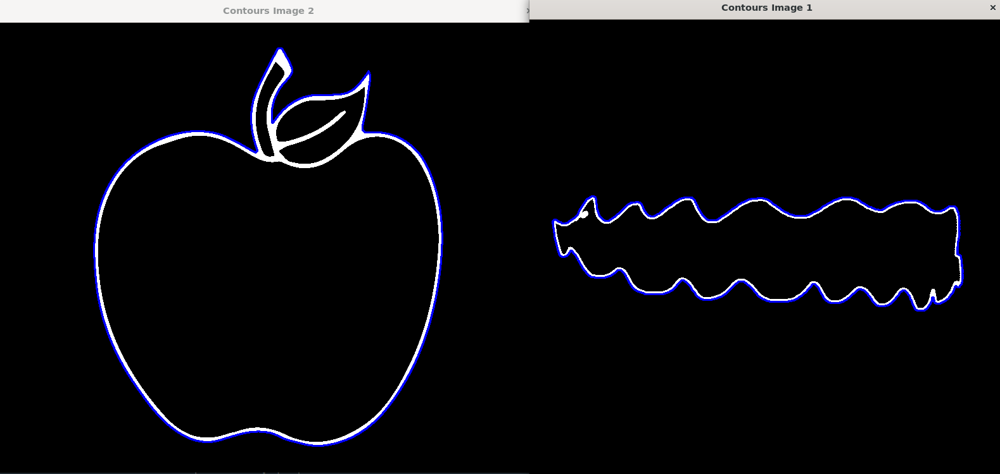
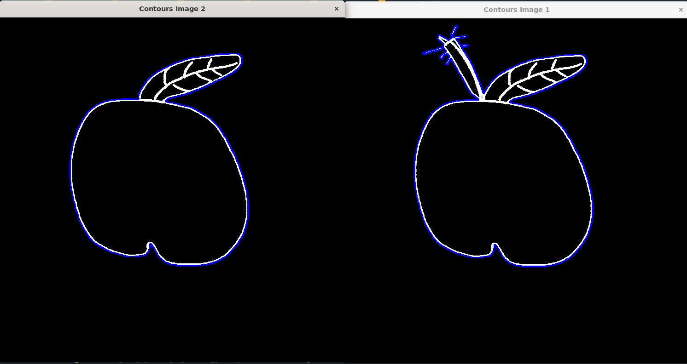

# Drawing Game with Image Similarity

This is a web-based drawing game that uses a simple canvas for user drawings and leverages OpenCV to compare two images and return a similarity score.

## How It Works

The core functionality of this app relies on OpenCV contour matching. Contour detection calculates the points of a shape and compares the sets of points in two images to derive a similarity score. This score indicates how closely the images resemble each other.

You can see visual examples taken from me during development of how this process works under the hood here:
- 
- 

This method is currently the most effective approach I've found for this type of application. However, it is not very accurate as it is a mathematical comparison that lacks human-like precision. For more information on how this works, you might explore [Hausdorff Distance](https://en.wikipedia.org/wiki/Hausdorff_distance).

The starting point for this approach was discussed in the [OpenCV Forum](https://forum.opencv.org/t/using-opencv-for-image-similarity/6444/13).
